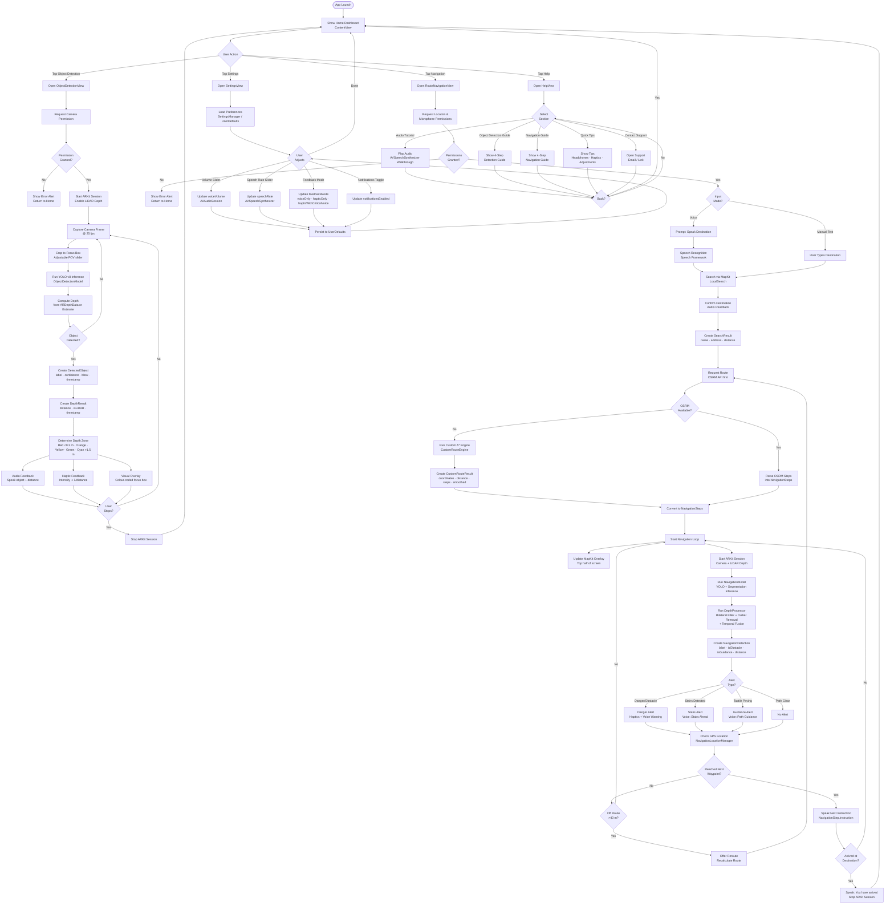
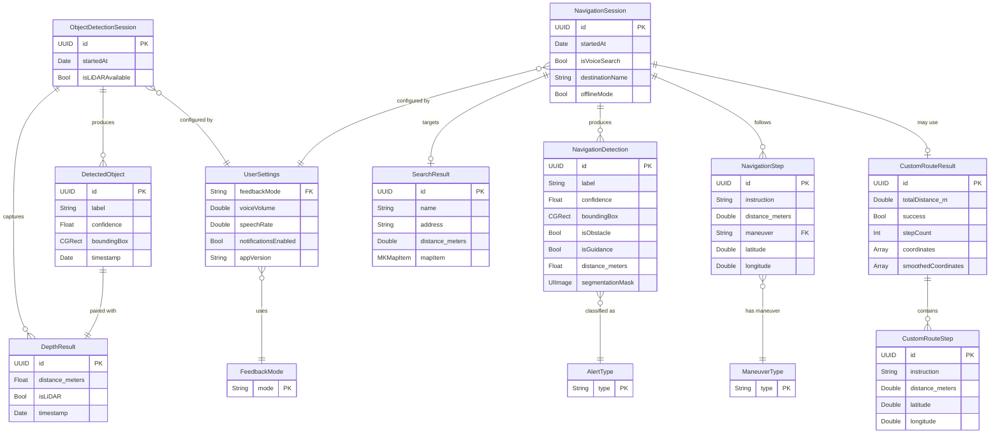

# VisionNav – Activity Diagram & Entity-Relation Diagram

## 1. Activity Diagram

The diagram below covers the four main user flows in VisionNav: **Object Detection**, **Route Navigation**, **Settings**, and **Help**.

---

## 2. Entity-Relation Diagram

The ER diagram covers all core data structures in VisionNav and shows how they relate to each other.

---

### Diagram Notes

| Diagram | Scope |
|---------|-------|
| **Activity Diagram** | All four major user flows: Object Detection, Route Navigation, Settings, Help |
| **ER Diagram** | All persistent/runtime data models: DetectedObject, DepthResult, NavigationDetection, NavigationStep, SearchResult, CustomRouteResult, UserSettings, and related enums |

**Technology quick reference**

| Concern | Technology |
|---------|-----------|
| Camera & Depth | ARKit 5 (smoothedSceneDepth) |
| Object Detection | YOLO v8 via CoreML / Vision |
| Audio Feedback | AVSpeechSynthesizer |
| Haptics | CoreHaptics (CHHapticEngine) |
| Routing (online) | OSRM API |
| Routing (offline) | Custom A\* (CustomRouteEngine) |
| Persistence | UserDefaults |
| Maps | MapKit / CoreLocation |
| Voice Input | Speech framework |
