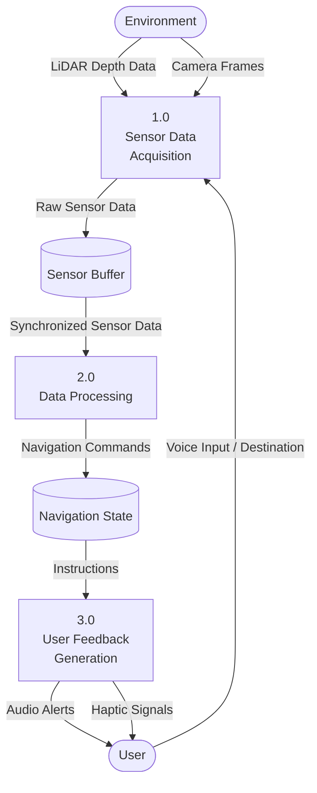
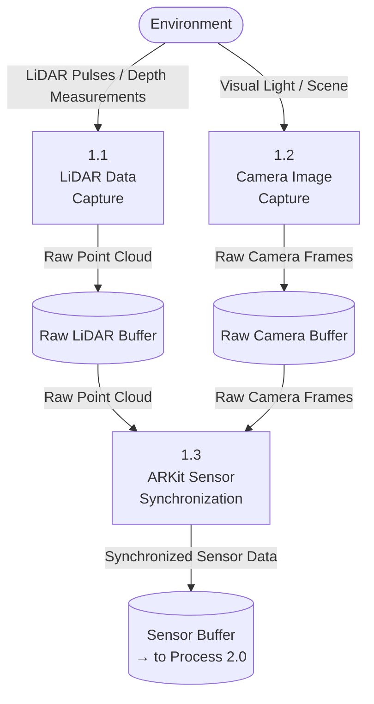
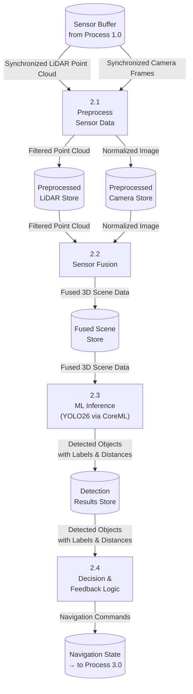

# Cover Page

## VisionNav Minor Project Report

### Submitted by: Nirdesh12

### Date: 2026-03-14

---

# Title Page

## Title: VisionNav – An iOS Application for Navigation

## Submitted to: [Institution Name Here]

---

# Acknowledgement

I would like to express my gratitude to [Names of people who helped] for their support and guidance.

---

# Abstract

This report presents the findings and outcomes of the VisionNav project, a Swift-based iOS application aimed at providing seamless navigational assistance.

---

# Table of Contents

1. Introduction
2. Literature Review
3. Methodology
4. Results and Conclusion
5. Future Enhancements
6. References
7. Appendices

---

# Introduction

The introduction of the VisionNav project outlines the objectives and scope of the application development.

---

# Literature Review

This section reviews the existing literature related to navigation solutions, focusing on mobile applications and technological advancements in iOS development.

---

# Methodology

The methodology outlines the development process, including the tools and frameworks used in the design and development of the VisionNav application.

---

## 3.3 Data Flow Diagrams (DFD)

A Data Flow Diagram (DFD) models how data moves through the VisionNav system — from sensor inputs through processing stages to user feedback outputs. The diagrams below present the system at three levels of detail.

---

### 3.3.1 Context Diagram (Level 0)

The Context Diagram shows VisionNav as a single process interacting with two external entities: the **User** (provides the environment to navigate) and the **Environment** (physical world sensed by LiDAR and Camera).

```
+-------------+    Destination / Voice Input    +-------------------+    LiDAR Depth Data   +-------------+
|             | -----------------------------> |                   | <-------------------- |             |
|    User     |                                |  0.0  VisionNav   |                        | Environment |
|             | <------------------------------ |    System         | <-------------------- |             |
+-------------+    Audio & Haptic Feedback     +-------------------+    Camera Frames       +-------------+
```

---

### 3.3.2 Level 1 DFD

The Level 1 DFD decomposes VisionNav into three main processes, their data flows, and the data stores involved.



---

### 3.3.3 Level 2 DFD – Process 1.0: Sensor Data Acquisition

This diagram expands **Process 1.0** into its sub-processes: LiDAR capture, camera capture, and ARKit-based sensor synchronization.



**Sub-process descriptions:**

| Sub-Process | Input | Processing | Output |
|---|---|---|---|
| 1.1 LiDAR Data Capture | Environment (physical space) | Emits laser pulses; measures time-of-flight to generate a 3D point cloud | Raw Point Cloud |
| 1.2 Camera Image Capture | Environment (visual scene) | Captures RGB frames at configured resolution and frame rate using AVFoundation | Raw Camera Frames |
| 1.3 ARKit Sensor Synchronization | Raw Point Cloud, Raw Camera Frames | Uses ARKit to temporally align and register depth and image data to a common coordinate frame | Synchronized Sensor Data |

---

### 3.3.4 Level 2 DFD – Process 2.0: Data Processing

This diagram expands **Process 2.0** into its four sub-processes: data preprocessing, sensor fusion, ML inference, and decision & feedback logic.



**Sub-process descriptions:**

| Sub-Process | Input | Processing | Output |
|---|---|---|---|
| 2.1 Preprocess Sensor Data | Raw LiDAR Point Cloud, Raw Camera Frames | **LiDAR:** Voxel-grid downsampling (up to 90% reduction), RoI truncation (Z ≤ 2 m), RANSAC floor-plane removal. **Camera:** Resize to model input dimensions, pixel normalisation, optional augmentation. | Filtered Point Cloud, Normalized Image |
| 2.2 Sensor Fusion | Filtered Point Cloud, Normalized Image | Aligns 3D point cloud coordinates with corresponding camera pixels using ARKit extrinsics; projects depth values onto the image plane to produce a dense, spatially-registered fused 3D scene representation. | Fused 3D Scene Data |
| 2.3 ML Inference (YOLO26 via CoreML) | Fused 3D Scene Data | Runs the YOLO26 model (NMS-free, DFL-removed) on-device via CoreML. Predicts bounding boxes, class labels (door, person, stair, furniture, etc.), and uses associated depth values for distance estimation. | Detected Objects with Labels & Distances |
| 2.4 Decision & Feedback Logic | Detected Objects with Labels & Distances | Ranks obstacles by proximity and relevance; selects the highest-priority hazard; constructs natural-language audio instructions (e.g., "Door ahead at 1.5 m") and corresponding haptic patterns for delivery to Process 3.0. | Navigation Commands (audio text + haptic pattern) |

---

# Results and Conclusion

Results from the project will be discussed here, summarizing the application's performance and potential impact.

---

# Future Enhancements

Suggestions for future enhancements and new features that could be added to the VisionNav application in subsequent releases.

---

# References

[1] Author Name, "Title of the Source". 

[2] Author Name, "Another Title of the Source".

---

# Appendices

Appendix A: Additional Resources

Appendix B: Glossary of Terms